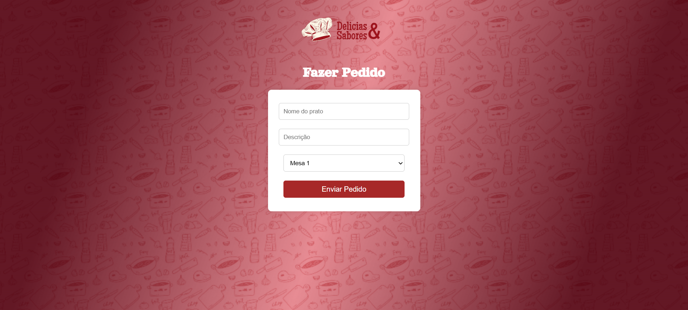

# Projeto delicia e sabor 
O projeto consiste em um sistema web desenvolvido para otimizar a comunicação entre garçons e a equipe da cozinha de um restaurante. A plataforma permite que o garçom registre o prato solicitado pelo cliente, incluindo a descrição detalhada e o número da mesa. Essas informações são enviadas automaticamente para a cozinha, onde são exibidas em uma tabela clara e organizada. O sistema possui áreas separadas, garantindo que cada equipe visualize apenas a sua parte: o garçom tem acesso apenas à interface de registro de pedidos, enquanto o pessoal da cozinha vê exclusivamente a tabela com as solicitações.

# Objetivos
- Facilitar a comunicação entre salão e cozinha.
- Reduzir erros na transmissão de pedidos.
- Aumentar a agilidade no atendimento ao cliente.
- Garantir um fluxo de informações organizado e seguro, com cada equipe acessando apenas o que é relevante para sua função.

# Observações
- O sistema possui controle de acesso por função (garçom ou cozinha).
- As informações são transmitidas em tempo real.
- A tabela da cozinha é atualizada automaticamente conforme novos pedidos são feitos.

# Participações e links: 

Participações:
> [Lohany Macedo](https://github.com/Lohanyy17)    
> [Mirele Victória](https://github.com/Mvictoria218)    
> [Maria Eduarda Gomes](https://github.com/MariaGomesR)  
> [Isabelly Dias Baptista](https://github.com/IDBaptista)  
> [Catarine Aparecida Almeida Tomaz](https://github.com/tomazzcatarine)  
> [Gabrielly Ribeiro de Lima Sena](https://github.com/GabySena)

Links:
> [Veja como ficou]()
